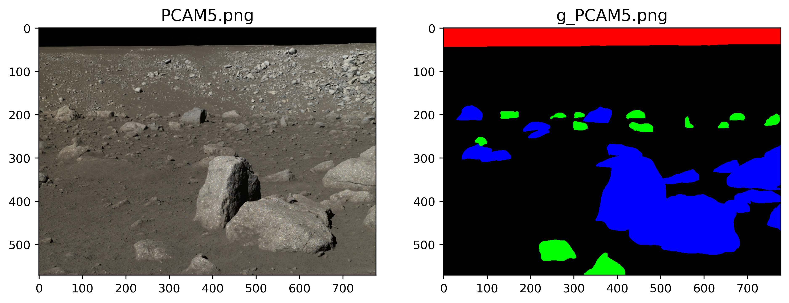

# **Artificial Lunar Landscape Images Segmentation using Transfer Learning on UNet-VGG16 CNN Architecture**

## **Project Status**

**UNDER DEVELOPMENT**

## **Background & Motivation**

As we all know, it is always difficult to find good datasets for image analysis, even more so when the data of interest is difficult to collect. In the field of space robotics, firsthand data is very scarce and seldom freely accessible. To the knowledge of the authors of the dataset, there exists no labelled dataset of planetary landscape images that could be used for any kind of machine learning approach to object detection or segmentation. The goal of the dataset is to openly provide a decent substitute for anyone who wishes to use such an approach on a lunar environment without manual labelling.

## **Dataset**

The dataset contains 9,766 realistic renders of rocky lunar landscapes, and their segmented equivalents (the 3 classes are the sky, smaller rocks, and larger rocks). A table of bounding boxes for all larger rocks and processed, cleaned-up ground truth images are also provided.

Sample Images:

<i>From left to right: Rendered Image, Ground Truth, Processed Ground Truth</i>

From above sample images, we can make a number of observations that should be kept in mind while using the dataset, in decreasing order of importance:

* **3** (technically 4) **classes are considered: large rocks (in blue), smaller rocks (in green), the sky (in red)** (and everything else, in black)
* **The segmented ground truth is not perfect.** In particular, there are some instances (like above) where a small rock is embedded in a larger rock.
* **The camera used is noise-free, and no data augmentation is performed.**
* **Only rocks measuring more than 10cm are usually represented on the segmented image.** This is to avoid cluttering and focus on rocks that are relevant to detect.
* **Colors go darker for distant rocks.** This is also to keep focus on relevant rocks, which are usually closest to the observer.
* **Bounding boxes are only drawn around blue rocks of intensity above 150 and dimensions above 20x20 pixels.** This is, again, to only consider rocks that are clearly visible while leaving aside those further away.

### Real Lunar Images

Real lunar pictures are also provided alongside the renders in the dataset. Those were taken by the Chang'e 3 rover (image credit: China National Space Administration (**CNSA**)), equipped with two cameras: **PCAM** and **TCAM**.

<i>From left to right: Original Picture, Ground Truth (hand-drawn)</i>

### Technical Information

* **Render dimensions:** 720x480 pixels
* **Camera FOV:** 65°
* **Camera film aperture:** 36x24mm
* **Camera focal length:** ~20mm
* **Camera orientation:** Yaw between 0° and 360°; Pitch between -30° and 0° (so as to limit the portion of images occupied by the sky); Roll between -20° and 20°
* **Sun elevation:** Random, uniform distribution between 20° and 40° for 75% of frames, between 40° and 50° for 25% of frames
* **Sun heading:** Random, uniform distribution between 0° and 360°

## **UNet-VGG16 CNN Model**

### What is a UNet?

The [UNet](https://arxiv.org/abs/1505.04597) was developed by Olaf Ronneberger et al. for Bio Medical Image Segmentation. The architecture contains two paths. First path is the contraction path (also called as the encoder) which is used to capture the context in the image. The encoder is just a traditional stack of convolutional and max pooling layers. The second path is the symmetric expanding path (also called as the decoder) which is used to enable precise localization using transposed convolutions. Thus, it is an end-to-end fully convolutional network (FCN), i.e. it only contains Convolutional layers and does not contain any Dense layer because of which it can accept image of any size.

In the original paper, the UNet is described as follows:

<i>U-net architecture (example for 32x32 pixels in the lowest resolution). Each blue box corresponds to a multi-channel feature map. The number of channels is denoted on top of the box. The x-y-size is provided at the lower left edge of the box. White boxes represent copied feature maps. The arrows denote the different operations.</i>

### Custom UNet-VGG16 Architecture

* VGG16 model pre-trained on the ImageNet dataset has been used as an Encoder network. The pooling blocks in the VGG16 model are kept frozen.
* A Decoder network has been extended from the last layer of the pre-trained model, and it is concatenated to the consecutive convolution blocks.

A detailed layout of the model is available [here.](./images/model_plot.png)

## **Results**

Due to computational constraints, the model is trained on only 5600 render images and their respective masks.

### Training Details
|Model|Epochs|Accuracy|Loss|
| :-----: | :-----: | :-----: | :-----: |
| UNet-VGG16 Transfer Learning Model | 30 | 44.54 % | 4.41618 |

|  |  |
| :-----: | :-----: |

### Segmentation Results

<i>From left to right: Input Image (Render Image), Segmented Image by the model, Ground Truth</i>

## **Conclusions**

* The UNet-VGG16 model is generating decent results, some of the segmentation results are not up to the mark.
* The model is able to differentiate between rocks (both large and small), sky and the lunar surface, but it can't differentiate between larger and smaller rocks.
* The model is terrible at segmenting the shadow effects by the rocks, it segments the shadow as sky.
* A lot more training and fine-tuning is required for the model.

## **Acknowledgements**

* The dataset is created by **Romain Pessia** and **Genya Ishigami** of the [Space Robotics Group](http://www.srg.mech.keio.ac.jp/index_en.html), Keio University, Japan. The authors also thank Quentin Jodelet, Keio University, for his invaluable help. To contact the author of the dataset, please reach out to [pessia[at]keio.jp]("mailto:pessia@keio.jp")
* The software used for creating the images and their ground truth is [Planetside Software's Terragen](https://planetside.co.uk/).
* The authors used NASA's [LRO LOLA Elevation Model](https://astrogeology.usgs.gov/search/details/Moon/LRO/LOLA/Lunar_LRO_LOLA_Global_LDEM_118m_Mar2014/cub) as a source of large-scale terrain data.

## **References**

* Dataset- https://www.kaggle.com/romainpessia/artificial-lunar-rocky-landscape-dataset
* Olaf Ronneberger, Philipp Fischer and Thomas Brox, "U-Net: Convolutional Networks for Biomedical Image Segmentation", arXiv:1505.
04597, 2015. [\[PDF\]](https://arxiv.org/pdf/1505.04597.pdf)
* Karen Simonyan and Andrew Zisserman, "Very Deep Convolutional Networks for Large-Scale Image Recognition", arXiv:1409.1556, 2014. [\[PDF\]](https://arxiv.org/pdf/1409.1556v6.pdf)
* Towards Data Science- [Understanding Semantic Segmentation with UNET](https://towardsdatascience.com/understanding-semantic-segmentation-with-unet-6be4f42d4b47), by Harshall Lamba
